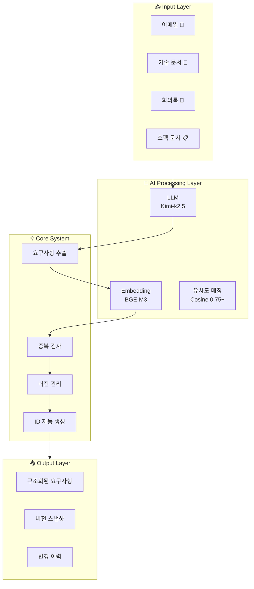
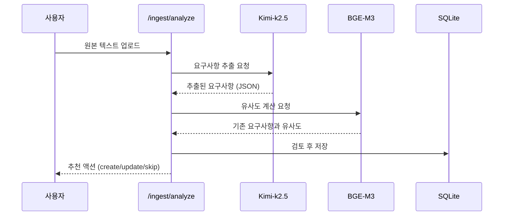
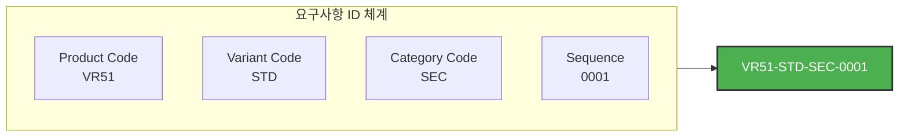
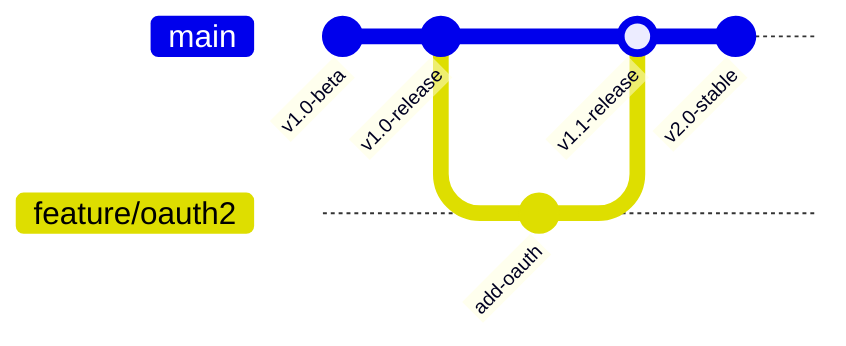
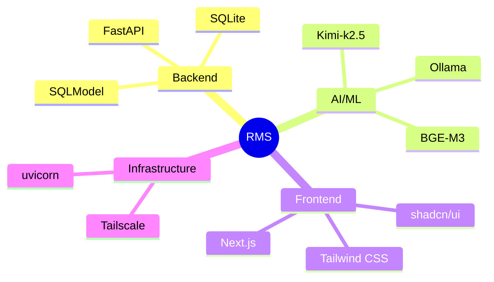
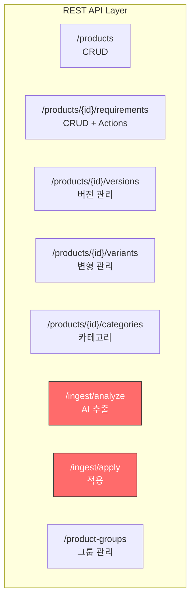
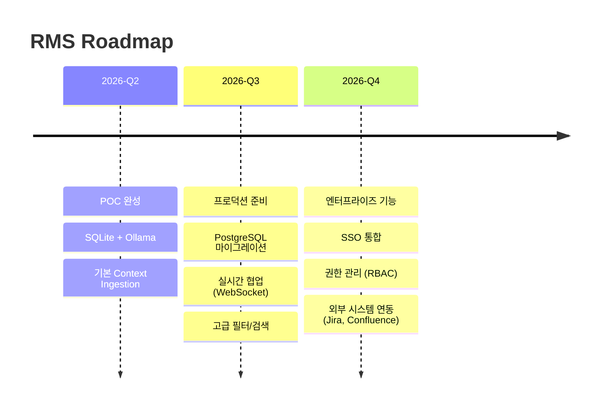

# Requirements Management System (RMS)

> **AI-Powered Requirements Extraction & Version Management Platform**

## 🎯 What is RMS?

RMS는 **AI 기반 요구사항 관리 시스템**입니다. 문서, 이메일, 회의록 등 비정형 데이터에서 자동으로 제품 요구사항을 추출하고, 버전 관리하며, 팀이 효율적으로 협업할 수 있게 합니다.

---

## 🏗️ Architecture Overview



---

## ✨ Key Features

### 1. AI Context Ingestion 🤖

**Before:** 수동으로 요구사항 입력
**After:** 문서/이메일 업로드 → AI가 자동 추출



**예시:**
```
입력: "The system must implement OAuth2 authentication for secure user login. 
       Users should be able to export their data to CSV format."

출력:
┌─────────────────────────────────────────────────────────┐
│ 📌 OAuth2 Authentication Support                        │
│    └─ 우선순위: critical | confidence: 0.9               │
│                                                          │
│ 📌 CSV Data Export                                       │
│    └─ 우선순위: medium | confidence: 0.9                 │
└─────────────────────────────────────────────────────────┘
```

---

### 2. Smart ID System 🏷️



**형식:** `{ProductCode}-{VariantCode}-{CategoryCode}-{Seq:04d}`

| 예시 | 설명 |
|------|------|
| `VR51-STD-SEC-0001` | VR51 제품, Standard 변형, Security 카테고리, 1번 |
| `VR51-PRO-CORE-0042` | VR51 제품, Pro 변형, Core 카테고리, 42번 |

---

### 3. Version Management 📦



**특정 시점의 요구사항 전체 스냅샷 저장**
- 언제든 이전 버전으로 rollback 가능
- 버전 간 diff 비교
- 릴리즈 관리

---

## 🛠️ Tech Stack



| 레이어 | 기술 | 용도 |
|--------|------|------|
| **Backend** | FastAPI + SQLModel | REST API, ORM |
| **Database** | SQLite (POC) / PostgreSQL (Prod) | 데이터 영속화 |
| **LLM** | Kimi-k2.5 (Ollama) | 요구사항 추출 |
| **Embedding** | BGE-M3 (Ollama) | 의미적 유사도 계산 |
| **Frontend** | Next.js 14 + shadcn/ui | 사용자 인터페이스 |
| **Network** | Tailscale | 보안 원격 접근 |

---

## 🔄 Data Flow

```mermaid
flowchart LR
    A["📝 Raw Context<br/>이메일/문서"] -->|"POST /ingest/analyze"| B["🤖 LLM Processing"]
    B -->|"Extracted JSON"| C["📊 Similarity Check<br/>BGE-M3 Embedding"]
    C -->|"Suggestions"| D["👤 Human Review"]
    D -->|"Selected Actions"| E["💾 Apply Changes<br/>POST /ingest/apply"]
    E -->|"req_id generated"| F["📦 Requirement Saved"]
    F -->|"Optional"| G["🏷️ Create Version"]
```



---

## 📊 API Endpoints



### Core Endpoints

| Method | Endpoint | 설명 |
|--------|----------|------|
| POST | `/ingest/analyze` | AI 요구사항 추출 |
| POST | `/ingest/apply` | 추출 결과 적용 |
| GET/POST | `/products/{id}/requirements` | 요구사항 CRUD |
| GET/POST | `/products/{id}/versions` | 버전 관리 |

---

## 🎯 Use Cases

### Scenario 1: 이메일에서 요구사항 추출

```
📧 수신 이메일:
"안녕하세요, 시스템에 OAuth2 로그인 기능을 추가해주세요. 
 또한 사용자 데이터를 CSV로 내보낼 수 있으면 좋겠습니다. 
 다음 주 금요일까지 완료 부탁드립니다."

↓ AI 분석

📋 추출된 요구사항:
   ✅ REQ-001: OAuth2 Authentication (critical)
   ✅ REQ-002: CSV Data Export (medium)
   ❌ 납기일 요청 (필터링됨)
```

### Scenario 2: 버전 관리

```
📦 v1.0-beta 릴리즈:
   - OAuth2 로그인
   - CSV 내보내기
   - 기본 검색 기능

📦 v1.0-stable 릴리즈:
   + SAML SSO 추가
   + 성능 최적화
```

---

## 🚀 Getting Started

### Prerequisites
- Python 3.9+
- Ollama (local LLM)
- Node.js 18+ (frontend)

### Backend Setup
```bash
cd backend
python -m venv venv
source venv/bin/activate
pip install -r requirements.txt

# .env 파일 생성
cat > .env << EOF
LLM_API_URL=http://localhost:11434/v1
LLM_MODEL=kimi-k2.5:cloud
EMBEDDING_API_URL=http://localhost:11434
EMBEDDING_MODEL=bge-m3
EOF

# Ollama 모델 다운로드
ollama pull kimi-k2.5:cloud
ollama pull bge-m3

# 서버 실행
python app.py
```

### Frontend Setup
```bash
cd frontend
npm install
npm run dev
```

---

## 📈 Future Roadmap



---

## 🏆 Key Achievements

| 기능 | 기술 | 상태 |
|------|------|------|
| AI 요구사항 추출 | Kimi-k2.5 | ✅ 완료 |
| 의미적 유사도 | BGE-M3 | ✅ 완료 |
| 자동 ID 생성 | {Product}-{Var}-{Cat}-{Seq} | ✅ 완료 |
| 버전 관리 | Snapshot 기반 | ✅ 완료 |
| 변경 이력 | Actions 테이블 | ✅ 완료 |
| 멀티 테넌트 | Product Groups | ✅ 완료 |

---

## 📞 Contact

- **Repository:** https://github.com/Vegitime-bot/Requirement_management
- **Tech Stack:** FastAPI, Next.js, SQLModel, Ollama
- **License:** MIT

---

*Built with ❤️ by Vegitime-bot*
