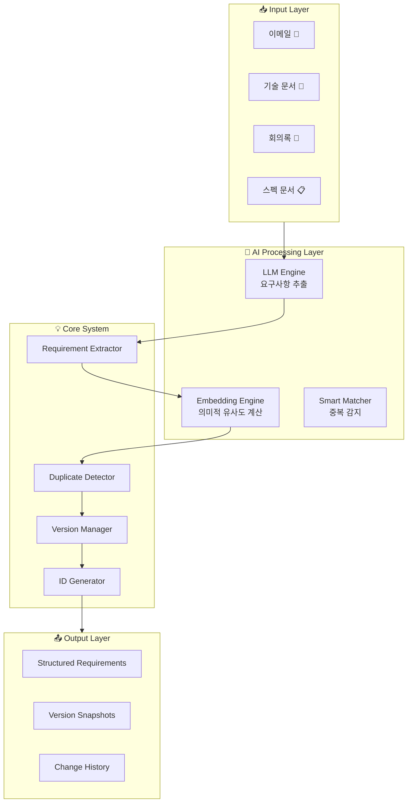
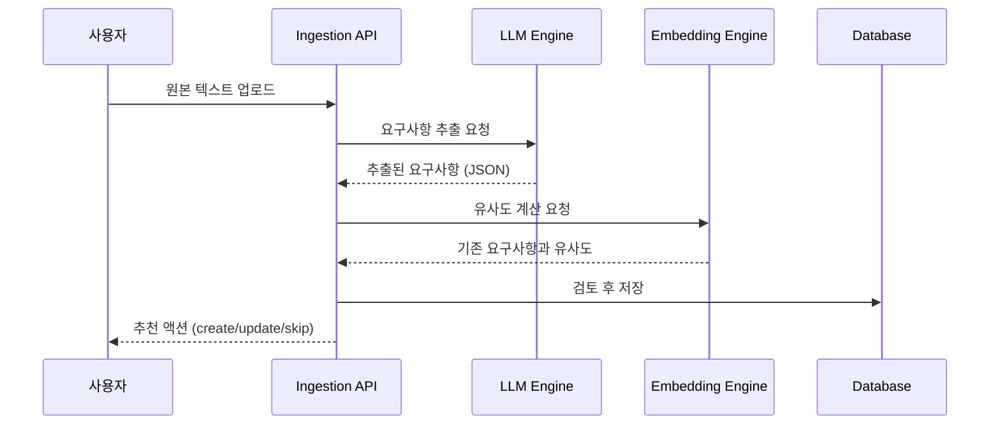
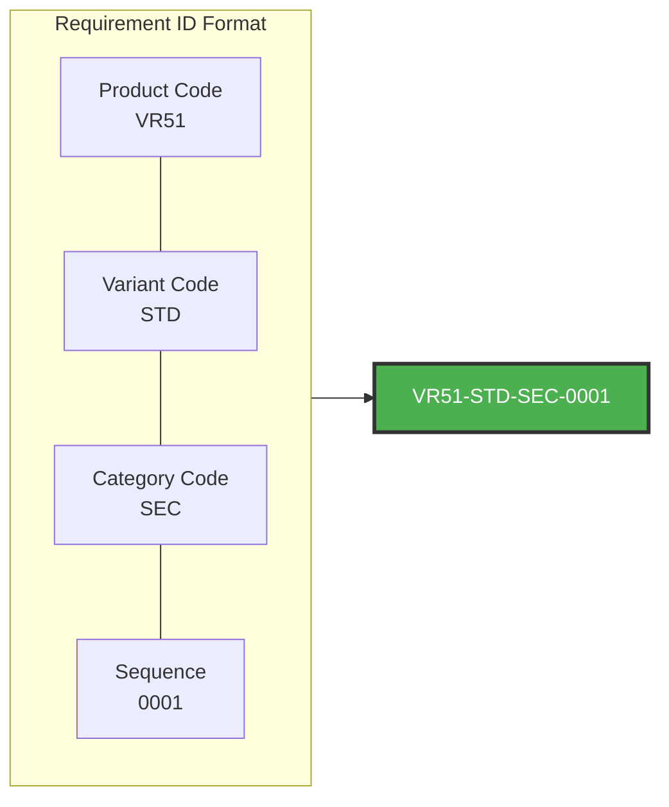
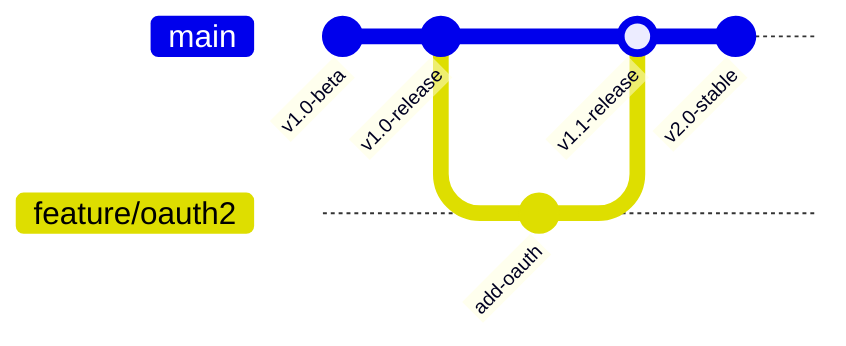
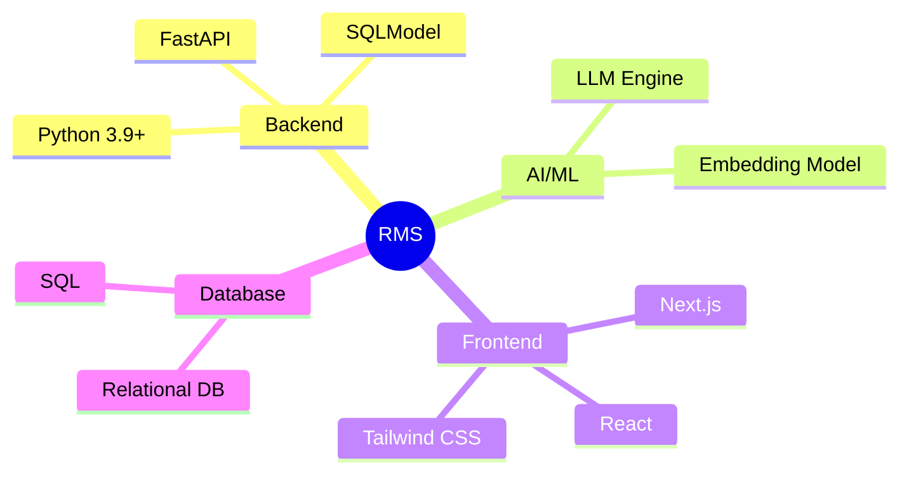
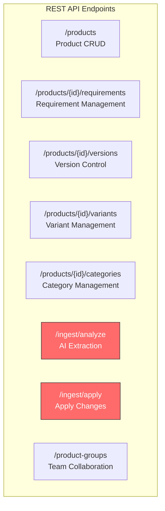
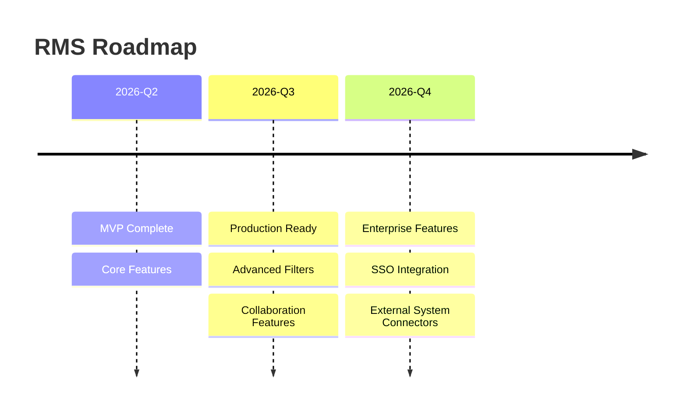

# Requirements Management System (RMS)

> **AI-Powered Requirements Extraction & Version Management Platform**

---

## 🎯 What is RMS?

RMS는 **AI 기반 요구사항 관리 시스템**입니다. 비정형 데이터(이메일, 문서, 회의록)에서 자동으로 제품 요구사항을 추출하고, 체계적인 버전 관리와 협업 기능을 제공합니다.

---

## 🏗️ System Architecture



---

## ✨ Key Features

### 1. AI Context Ingestion 🤖

**Before:** 수동으로 요구사항 입력  
**After:** 문서 업로드 → AI가 자동 추출



**Example:**

```
📧 Input (Email):
"안녕하세요, 시스템에 OAuth2 로그인 기능을 추가해주세요. 
또한 사용자 데이터를 CSV로 내보낼 수 있으면 좋겠습니다. 
다음 주 금요일까지 완료 부탁드립니다."

↓ AI Analysis

📋 Output (Structured Requirements):
┌─────────────────────────────────────────────────────────┐
│ 📌 REQ-001: OAuth2 Authentication Support               │
│    └─ Priority: Critical | Confidence: 0.92          │
│                                                          │
│ 📌 REQ-002: CSV Data Export                             │
│    └─ Priority: Medium | Confidence: 0.89            │
│                                                          │
│ 🗑️ Filtered: "다음 주 금요일까지" (Deadline, not req)  │
└─────────────────────────────────────────────────────────┘
```

---

### 2. Smart ID System 🏷️



**Format:** `{ProductCode}-{VariantCode}-{CategoryCode}-{Seq:04d}`

| Example | Description |
|---------|-------------|
| `VR51-STD-SEC-0001` | VR51 Product, Standard Variant, Security Category, #1 |
| `VR51-PRO-CORE-0042` | VR51 Product, Pro Variant, Core Category, #42 |

---

### 3. Version Management 📦



**Capabilities:**
- 특정 시점의 요구사항 전체 스냅샷 저장
- 언제든 이전 버전으로 rollback 가능
- 버전 간 diff 비교
- 릴리즈 관리

---

## 🛠️ Technology Stack



| Layer | Technology | Purpose |
|-------|------------|---------|
| **Backend** | FastAPI + SQLModel | REST API, ORM |
| **Database** | PostgreSQL | Data Persistence |
| **LLM** | OpenAI Compatible API | Requirement Extraction |
| **Embedding** | Vector Embeddings | Semantic Similarity |
| **Frontend** | Next.js + React | User Interface |

---

## 🔄 Data Flow

```mermaid
flowchart LR
    A["📝 Raw Context<br/>Email/Doc/Meeting"] -->|"POST /ingest/analyze"| B["🤖 LLM Processing"]
    B -->|"Extracted JSON"| C["📊 Similarity Check<br/>Embedding"]
    C -->|"Suggestions"| D["👤 Human Review"]
    D -->|"Selected Actions"| E["💾 Apply Changes<br/>POST /ingest/apply"]
    E -->|"req_id generated"| F["📦 Requirement Saved"]
    F -->|"Optional"| G["🏷️ Create Version"]
```



---

## 📊 API Overview



### Core Endpoints

| Method | Endpoint | Description |
|--------|----------|-------------|
| POST | `/ingest/analyze` | AI-powered requirement extraction |
| POST | `/ingest/apply` | Apply extracted requirements |
| GET/POST | `/products/{id}/requirements` | Requirement CRUD + Actions |
| GET/POST | `/products/{id}/versions` | Version management |

---

## 🎯 Use Cases

### Scenario 1: Email to Structured Requirements

```
📧 Received Email:
"안녕하세요, 시스템에 OAuth2 로그인 기능을 추가해주세요. 
또한 사용자 데이터를 CSV로 내보낼 수 있으면 좋겠습니다. 
다음 주 금요일까지 완료 부탁드립니다."

↓ AI Processing

📋 Extracted Requirements:
   ✅ REQ-001: OAuth2 Authentication (critical)
   ✅ REQ-002: CSV Data Export (medium)
   ❌ Deadline request (filtered out)

💡 Suggested Actions:
   - Create REQ-001: New requirement
   - Create REQ-002: New requirement
```

### Scenario 2: Duplicate Prevention

```
📝 New Input: "Implement OAuth2-based user authentication"

🔍 Existing: "Add OAuth2 login support for secure access"

📊 Similarity Score: 0.835 (High)

💡 Suggestion: UPDATE existing requirement instead of creating duplicate
```

### Scenario 3: Version Management

```
📦 v1.0-beta Release:
   - OAuth2 Authentication
   - CSV Export
   - Basic Search

📦 v1.0-stable Release:
   + SAML SSO (added)
   + Performance Optimization (added)
   
🔒 Snapshot saved: All requirements at v1.0-stable state
```

---

## 🏆 Key Achievements

| Feature | Technology | Status |
|---------|------------|--------|
| AI Requirement Extraction | LLM | ✅ Complete |
| Semantic Similarity | Vector Embeddings | ✅ Complete |
| Auto ID Generation | Structured Format | ✅ Complete |
| Version Management | Snapshot-based | ✅ Complete |
| Change History | Event Sourcing | ✅ Complete |
| Multi-tenancy | Product Groups | ✅ Complete |
| Duplicate Detection | Cosine Similarity | ✅ Complete |

---

## 🚀 Getting Started

### Prerequisites
- Python 3.9+
- Node.js 18+
- LLM API Access (OpenAI Compatible)

### Quick Start

```bash
# 1. Clone Repository
git clone https://github.com/Vegitime-bot/Requirement_management.git
cd Requirement_management

# 2. Setup Backend
cd backend
python -m venv venv
source venv/bin/activate
pip install -r requirements.txt

# 3. Configure Environment
cp .env.example .env
# Edit .env with your LLM API settings

# 4. Run Backend
python app.py

# 5. Setup Frontend (New Terminal)
cd ../frontend
npm install
npm run dev

# 6. Open Browser
# http://localhost:3000
```

---

## 📁 Project Structure

```
requirements-management-system/
├── backend/
│   ├── app.py                 # FastAPI application
│   ├── services/
│   │   ├── llm.py            # LLM integration
│   │   └── embedding.py      # Embedding service
│   └── tests/                # Test suite
├── frontend/
│   ├── app/                  # Next.js pages
│   └── components/           # React components
├── docs/                     # Documentation
└── README.md                 # This file
```

---

## 📈 Future Roadmap



---

## 📞 Links

- **Repository:** https://github.com/Vegitime-bot/Requirement_management
- **Documentation:** See `docs/` directory

---

*Built with ❤️ for better requirement management*
