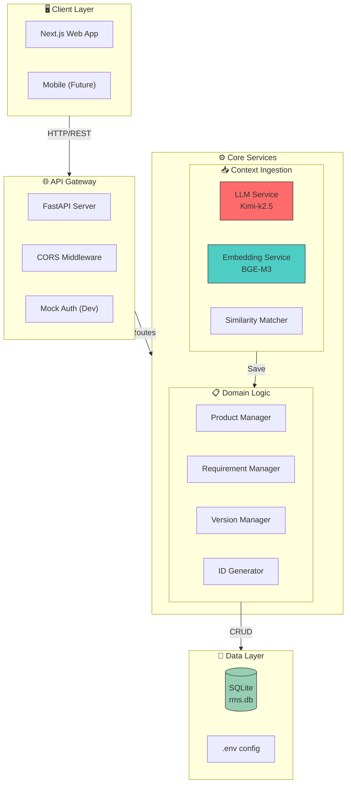
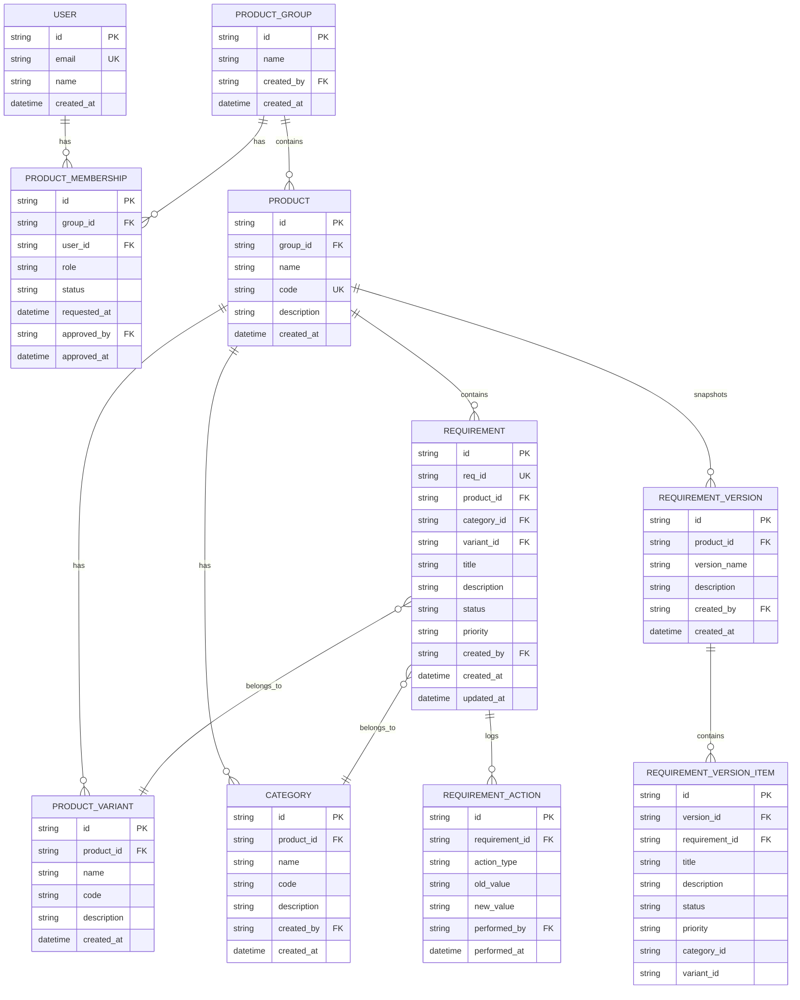
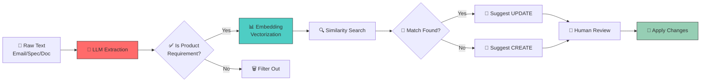
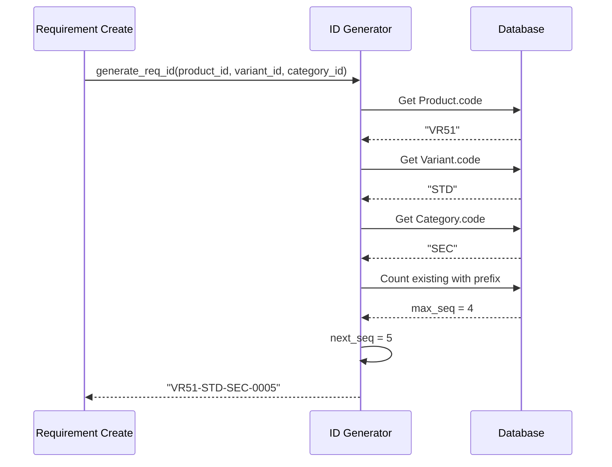
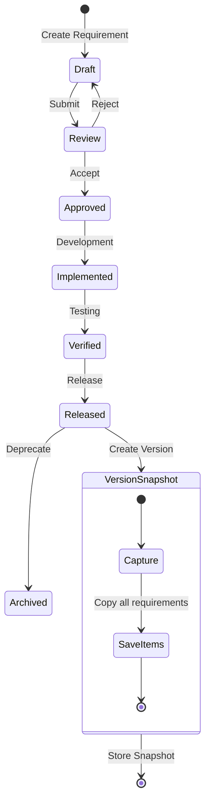
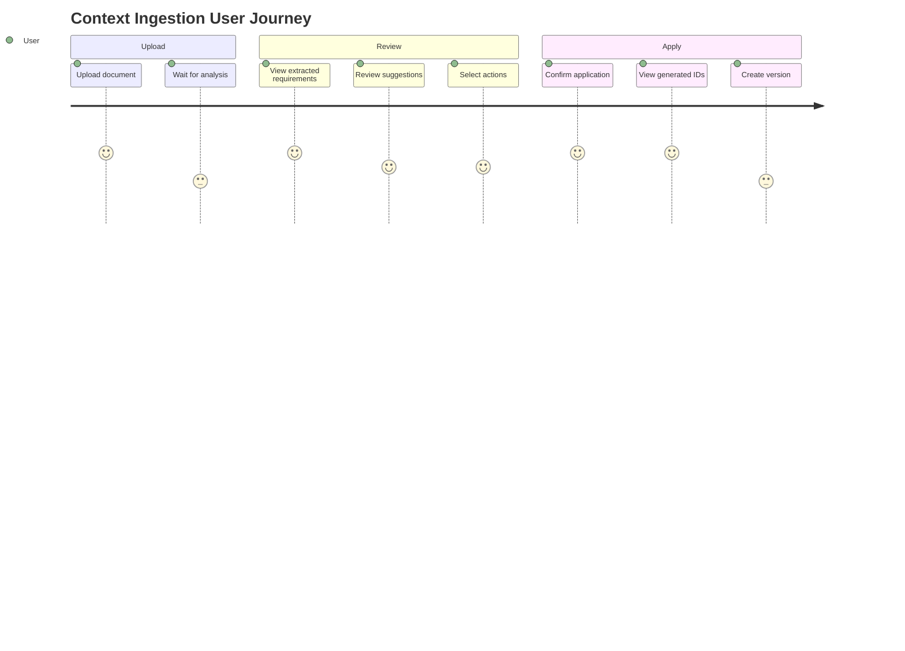
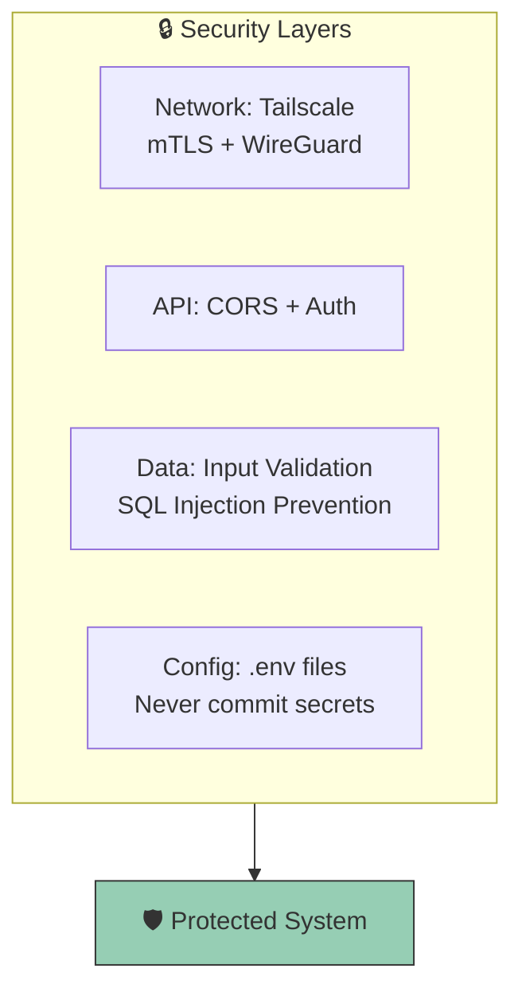
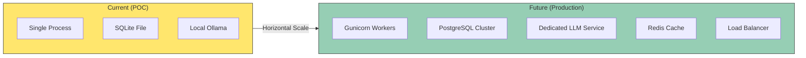

# RMS Architecture

## System Overview

## Database Schema

## AI Processing Pipeline

## ID Generation Flow

## Version Management Flow

## Request Lifecycle

## Technology Decisions

| Decision | Choice | Rationale |
|----------|--------|-----------|
| **Database (POC)** | SQLite | Zero config, portable, file-based |
| **Database (Prod)** | PostgreSQL | Scalable, concurrent access |
| **ORM** | SQLModel | Type-safe, FastAPI native |
| **LLM** | Kimi-k2.5 | Korean/English bilingual, Ollama compatible |
| **Embedding** | BGE-M3 | Multilingual, SOTA performance |
| **API Framework** | FastAPI | Async native, auto OpenAPI docs |
| **Frontend** | Next.js 14 + shadcn/ui | Modern, accessible, rapid development |
| **Network** | Tailscale | Secure remote access, zero config VPN |

## Security Considerations

## Performance Characteristics

| Operation | Latency | Notes |
|-----------|---------|-------|
| LLM Extraction | 2-5s | Depends on context length |
| Embedding Generation | 100-300ms | Per text chunk |
| Similarity Search | 50-100ms | In-memory cache |
| Database Query | 10-50ms | SQLite, indexed |
| API Response | 3-6s | Total pipeline |

## Scaling Strategy

---

*Last Updated: 2026-04-26*
