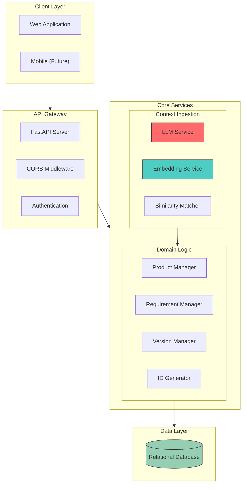
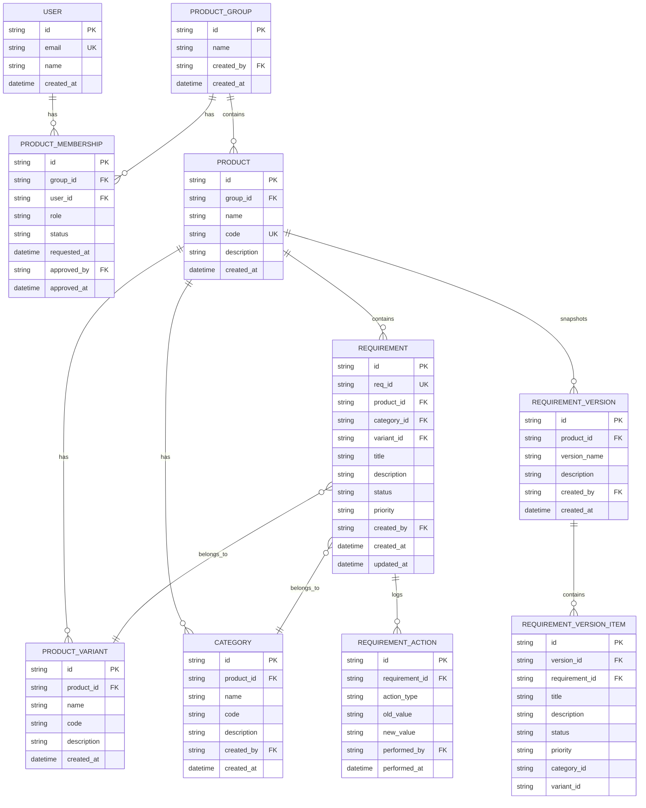
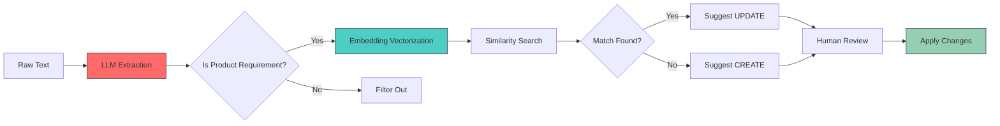
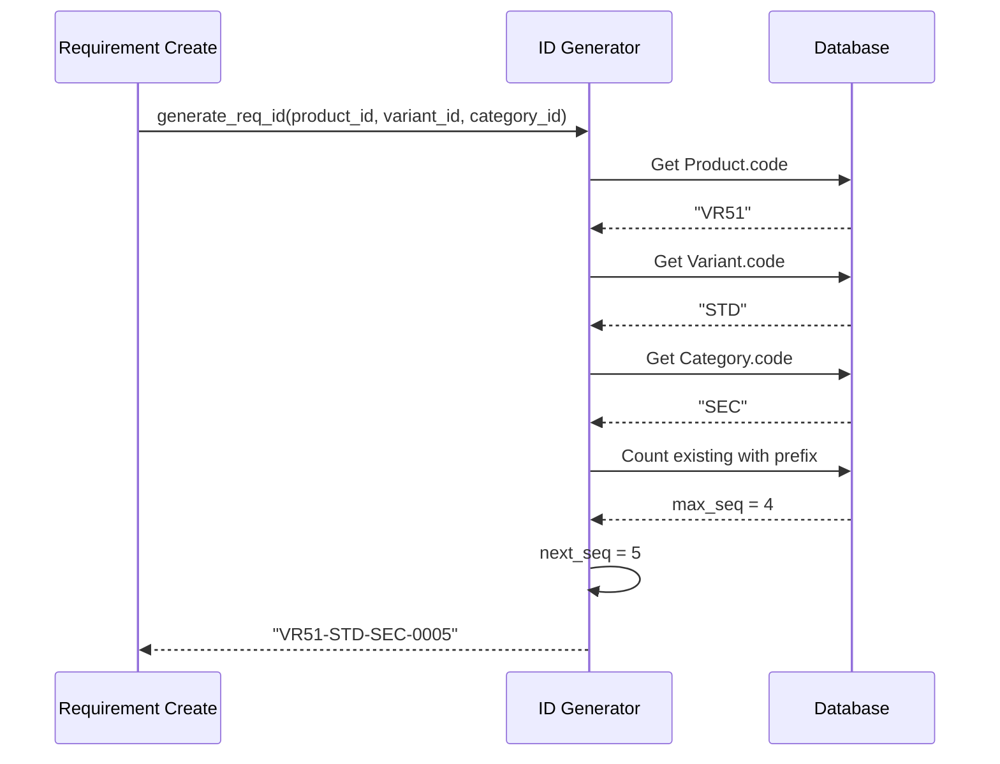
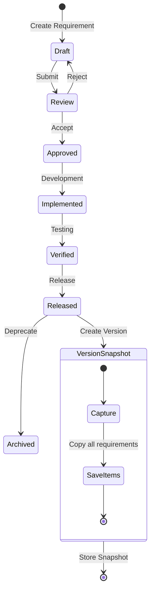
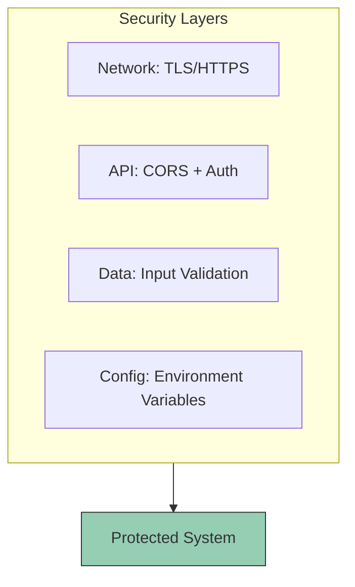
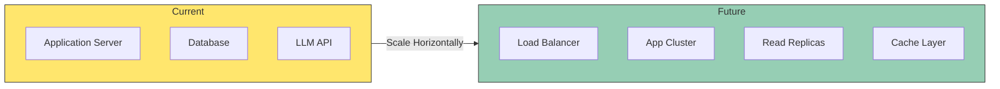

# RMS Architecture

## System Overview

## Database Schema

## AI Processing Pipeline

## ID Generation Flow

## Version Management Flow

## Technology Stack

| Layer | Technology | Rationale |
|-------|------------|-----------|
| **Backend** | FastAPI + SQLModel | Type-safe, async-native, OpenAPI docs |
| **Database** | PostgreSQL | ACID compliant, scalable |
| **ORM** | SQLModel | Pydantic + SQLAlchemy integration |
| **LLM** | OpenAI Compatible API | Flexible provider selection |
| **Embedding** | Vector Embeddings | Semantic similarity search |
| **Frontend** | Next.js + React | SSR, modern DX |
| **Styling** | Tailwind CSS | Utility-first, rapid development |

## Security Considerations

## Scaling Strategy

---

*Last Updated: 2026-04-26*
