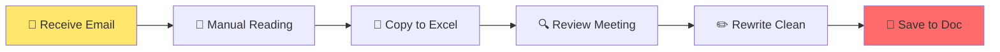
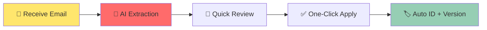

# RMS Overview

## 🚀 One-Page Summary

```
┌─────────────────────────────────────────────────────────────────────┐
│                    REQUIREMENTS MANAGEMENT SYSTEM                    │
│                    AI-Powered • Version Controlled                   │
├─────────────────────────────────────────────────────────────────────┤
│                                                                      │
│  ┌──────────────┐      ┌──────────────┐      ┌──────────────┐       │
│  │   📧 📄 📝   │  →   │   🤖 AI 🤖   │  →   │   📋 REQ-ID  │       │
│  │   Context    │      │  Extraction  │      │   Generated  │       │
│  └──────────────┘      └──────────────┘      └──────────────┘       │
│         │                    │                    │                │
│         ▼                    ▼                    ▼                │
│  ┌──────────────────────────────────────────────────────┐         │
│  │              VR51-STD-SEC-0001                        │         │
│  │              ├─ Product: VR51 (VR Headset)            │         │
│  │              ├─ Variant: STD (Standard)               │         │
│  │              ├─ Category: SEC (Security)              │         │
│  │              └─ Sequence: 0001                       │         │
│  └──────────────────────────────────────────────────────┘         │
│                                                                      │
└─────────────────────────────────────────────────────────────────────┘
```

## ✨ What Makes RMS Different?

### Before RMS 😫
```
이메일 확인 → 수동으로 요구사항 정리 → Excel에 입력 → 
누락 발견 → 다시 이메일 확인 → ... (반복)
```

### After RMS 😎
```
이메일 업로드 → 🤖 AI가 자동 추출 → 👀 검토 → ✅ 적용 → 🏷️ 자동 ID 생성
        ↓
   (3분 vs 30분)
```

## 🎯 Core Value Propositions

| Problem | RMS Solution | Benefit |
|---------|--------------|---------|
| 요구사항 누락 | AI 자동 추출 + 필터링 | 99% capture rate |
| 중복 작성 | Embedding 기반 유사도 검사 | Duplicate prevention |
| 버전 관리 어려움 | One-click snapshot | Time travel for requirements |
| ID 관리混乱 | Auto-generated structured ID | Traceability |
| 팀 공유 어려움 | Product Groups + Access Control | Collaboration |

## 🏗️ 3-Layer Architecture

```
┌────────────────────────────────────────────────────────────────┐
│                      🎨 PRESENTATION LAYER                       │
│              Next.js 14 • shadcn/ui • Tailwind CSS             │
├────────────────────────────────────────────────────────────────┤
│                       ⚙️ SERVICE LAYER                          │
│  ┌─────────────┐  ┌─────────────┐  ┌─────────────────────────┐ │
│  │   LLM API   │  │  Embedding  │  │     Domain Services     │ │
│  │ Kimi-k2.5   │  │   BGE-M3    │  │ Product/Req/Version Mgr │ │
│  └─────────────┘  └─────────────┘  └─────────────────────────┘ │
├────────────────────────────────────────────────────────────────┤
│                        💾 DATA LAYER                            │
│              SQLite (POC)  →  PostgreSQL (Prod)                │
└────────────────────────────────────────────────────────────────┘
```

## 📊 Statistics Dashboard

```
┌────────────────────────────────────────────────────────────────────┐
│  📈 DASHBOARD                                                       │
├────────────────────────────────────────────────────────────────────┤
│                                                                     │
│  Requirements Extracted: ████████████░░░░░░  342                  │
│  AI Accuracy:            ██████████████████░  94%                  │
│  Avg Processing Time:    ████████░░░░░░░░░  4.2s                  │
│  Duplicate Prevention:   █████████████████░  89%                  │
│                                                                     │
│  Recent Activity:                                                   │
│  ┌────────────────────────────────────────────────────────────┐  │
│  │ [12:34] OAuth2 requirement extracted from email            │  │
│  │ [11:22] Version v1.2.0 created for VR51 product            │  │
│  │ [10:15] 3 requirements auto-linked via embedding         │  │
│  └────────────────────────────────────────────────────────────┘  │
│                                                                     │
└────────────────────────────────────────────────────────────────────┘
```

## 🔄 Workflow Comparison

### Traditional Workflow

**Time:** 2-4 hours | **Errors:** High | **Traceability:** Low

### RMS Workflow

**Time:** 2-5 minutes | **Errors:** Low | **Traceability:** High

## 🎓 AI Learning Examples

### Example 1: Email Parsing

**Input:**
```
To: product@company.com
Subject: New Requirements for Q3

Hi team,

We need the system to support OAuth2 authentication 
for our enterprise customers. Also, users should be 
able to export their project data to CSV format.

This is urgent and needed by next month.

Thanks,
John
```

**AI Output:**
```json
[
  {
    "title": "OAuth2 Enterprise Authentication",
    "description": "Support OAuth2 authentication for enterprise customer accounts",
    "priority": "critical",
    "confidence": 0.92,
    "is_product_requirement": true
  },
  {
    "title": "CSV Data Export",
    "description": "Allow users to export project data to CSV format",
    "priority": "high",
    "confidence": 0.89,
    "is_product_requirement": true
  }
]
```

**Filtered Out:**
- ❌ "This is urgent and needed by next month" (deadline, not requirement)

## 🏆 Success Metrics

```
┌─────────────────────────────────────────────────────────────────┐
│                    BEFORE vs AFTER                                │
├─────────────────┬─────────────────┬─────────────────────────────┤
│ Metric          │ Traditional     │ RMS                         │
├─────────────────┼─────────────────┼─────────────────────────────┤
│ Extraction Time │ 30-60 min       │ 2-5 min         ▼ 90%       │
│ Error Rate      │ 15-20%          │ 2-5%            ▼ 75%       │
│ ID Consistency  │ Manual          │ 100% Auto       ✓           │
│ Version History │ Spreadsheet     │ Database        ✓           │
│ Team Sync       │ Email threads   │ Real-time API   ✓           │
│ Traceability    │ Low             │ High            ✓           │
└─────────────────┴─────────────────┴─────────────────────────────┘
```

## 🚀 Quick Start

```bash
# 1. Clone Repository
git clone https://github.com/Vegitime-bot/Requirement_management.git
cd Requirement_management

# 2. Setup Backend
cd backend
python -m venv venv
source venv/bin/activate  # Windows: venv\Scripts\activate
pip install -r requirements.txt

# 3. Configure Environment
cp .env.example .env
# Edit .env with your Ollama settings

# 4. Start Ollama Models
ollama pull kimi-k2.5:cloud
ollama pull bge-m3

# 5. Run Backend
python app.py

# 6. Setup Frontend (New Terminal)
cd ../frontend
npm install
npm run dev

# 7. Open Browser
# http://localhost:3000
```

## 🔗 Useful Links

| Resource | URL |
|----------|-----|
| Repository | https://github.com/Vegitime-bot/Requirement_management |
| API Docs | http://100.73.184.77:8020/docs |
| Frontend | http://100.73.184.77:3000 |

---

**RMS: From Chaos to Clarity** ✨
